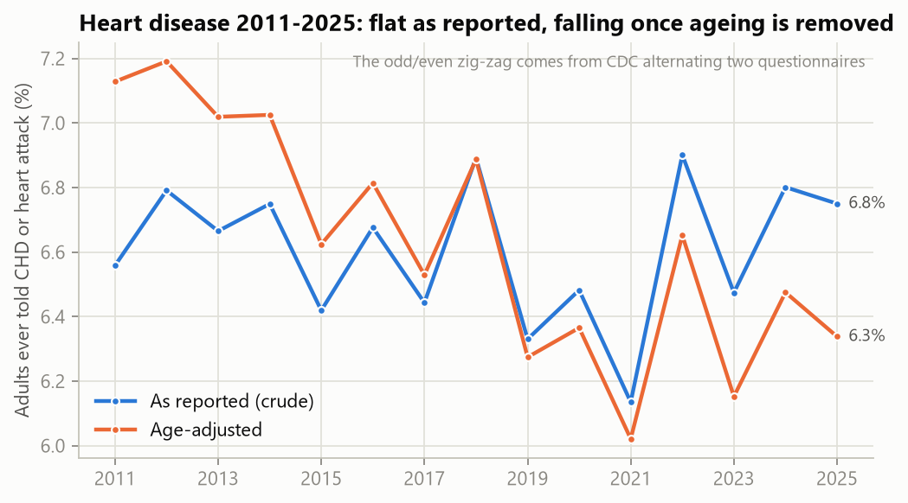
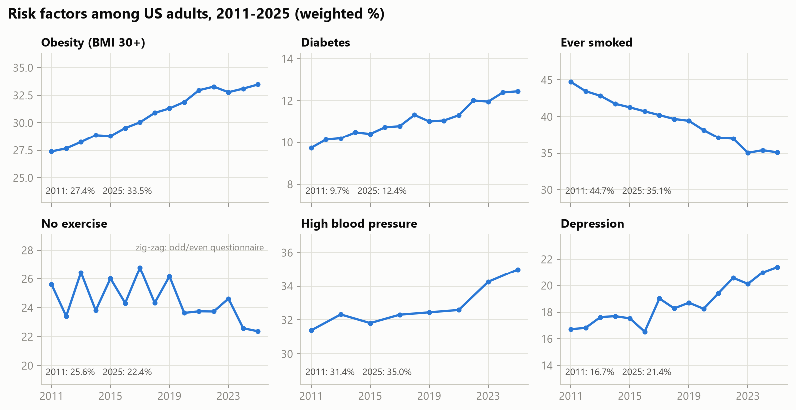
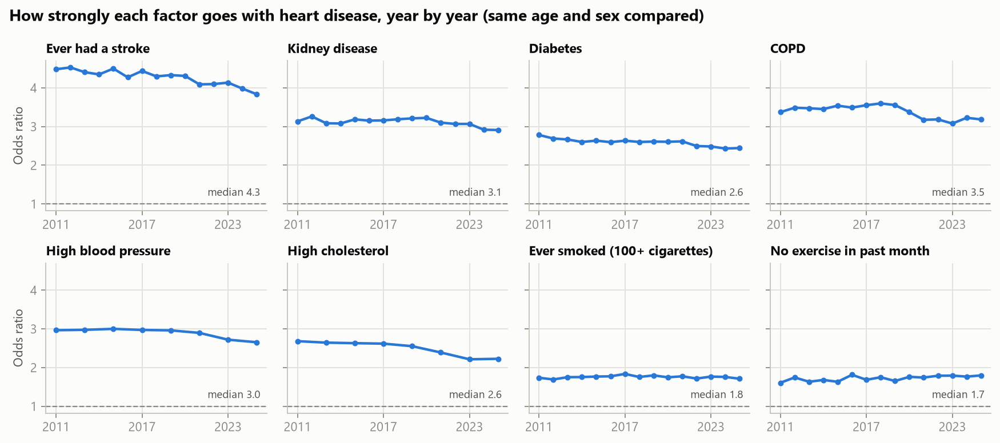
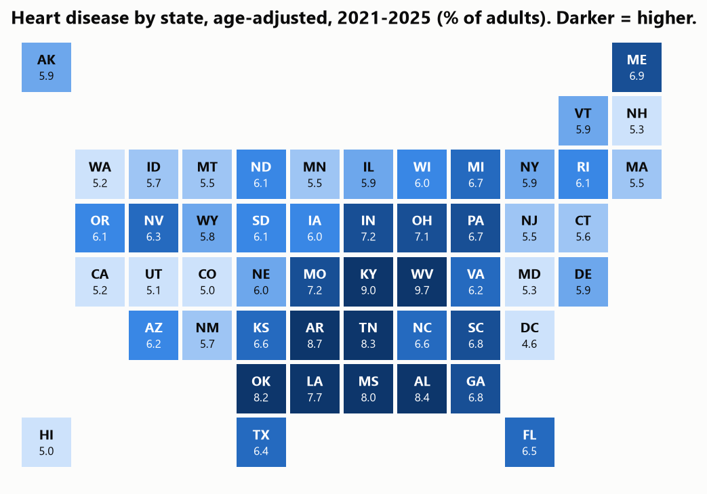
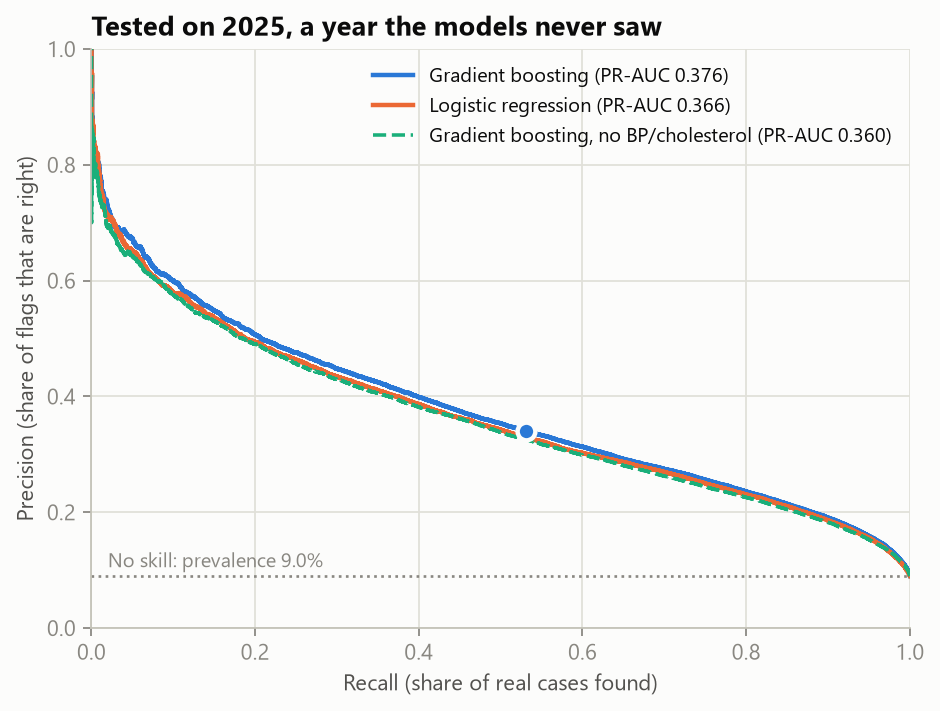
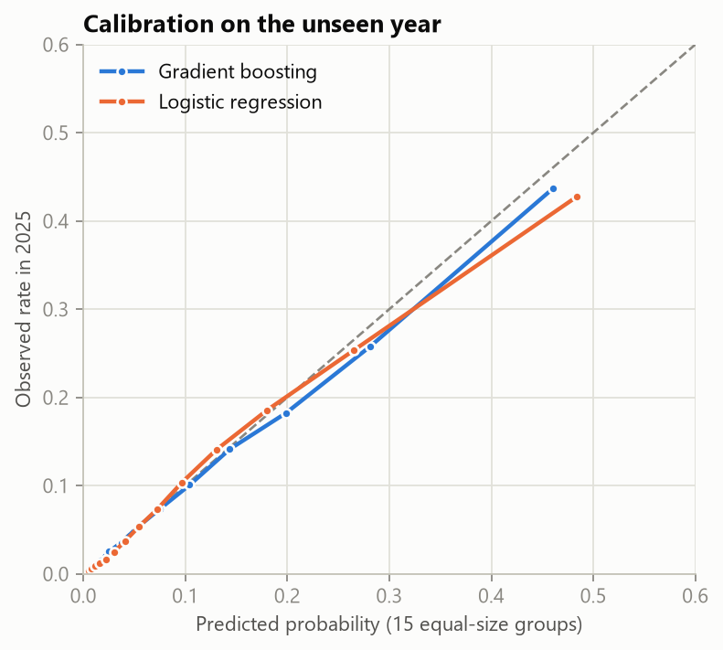
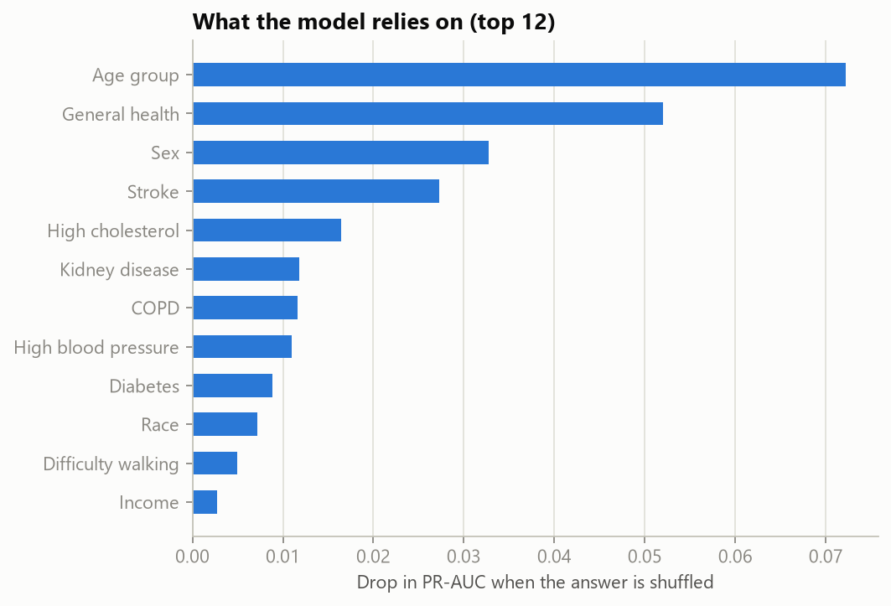
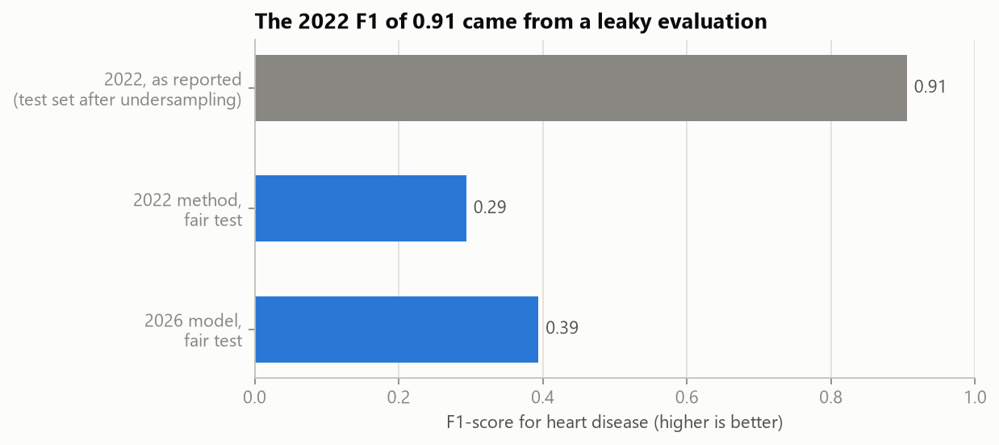

# Heart Disease Risk Model: 15 Years of CDC Survey Data

A heart disease risk model and analysis built on **15 yearly CDC surveys (2011-2025, 6.7 million US adults)**, harmonised into one dataset. The model is trained on 2011-2023 and tested once on 2025, a year it never saw. It started as an audit of my 2022 version of this project, whose headline results came from a data leak.

**[Try the app](#the-app)** · [Key results](#key-results) · [What 15 years show](#what-15-years-of-data-show) · [The 2022 audit](#part-1-auditing-my-2022-version) · [Reproduce](#reproduce)


## Key results

Tested once on **2025**: 352,145 people the model never saw, 9.0% of whom reported heart disease.

| Model | ROC-AUC | PR-AUC | F1 | Precision | Recall |
|---|---|---|---|---|---|
| Always answer "No" (baseline) | 0.500 | 0.090 | 0.000 | n/a | 0.000 |
| Logistic regression | 0.845 | 0.366 | 0.407 | 0.332 | 0.524 |
| Gradient boosting without blood pressure and cholesterol | 0.842 | 0.361 | 0.402 | 0.317 | 0.551 |
| **Gradient boosting** (used in the app) | **0.851** | **0.376** | **0.415** | **0.341** | **0.531** |

- **PR-AUC 0.376 is 4 times the no-skill level (0.090).** Accuracy is not used: answering "No" for everyone scores 91% and finds nobody.
- **Weighted to the US adult population** with the survey weights, ROC-AUC is 0.872.
- **The probabilities can be trusted:** when the model says about 20%, about 18-20% of those people reported heart disease ([calibration](#the-model)).
- **Spot checks against the raw data:** for men aged 60-64 with high blood pressure, smoking and no exercise but no other conditions, the app says 9.3% and the real rate among 634 such men is 9.3%. Add high cholesterol: 22% vs 20.1% among 826 men.
- **Two ways to use it:** at the F1 cut-off (22.5%), 1 in 3 flags is right and half the cases are found. At the screening cut-off (9.8%), 81% of cases are found and about 1 in 4 flags is right.

## What 15 years of data show

All rates below use the survey weights, so they describe US adults rather than just the people who answered.



- **Heart disease looks flat, but it is falling.** As reported, 6.6% of adults in 2011 and 6.8% in 2025. The population got older over these years; once that is removed (direct age standardisation), the rate fell from 7.1% to 6.3%.
- **The zig-zag is a survey artefact, not a health effect.** CDC alternates two questionnaires between odd and even years, and some answers shift with the version.



- **Most risk factors got worse:** obesity 27.4% to 33.5%, diabetes 9.7% to 12.4%, high blood pressure 31.4% to 35.0%, depression 16.7% to 21.4%. Smoking is the exception: adults who ever smoked fell from 44.7% to 35.1%.



- **The strongest links are stable across 15 years** (Mantel-Haenszel odds ratios, comparing people of the same age group and sex): stroke 4.3, COPD 3.5, kidney disease 3.1, high blood pressure 3.0, diabetes 2.6, high cholesterol 2.6, smoking 1.8, no exercise 1.75.
- **Two links weakened:** high cholesterol went from 2.7 to 2.2 and high blood pressure from 3.0 to 2.7. One possible reason is wider treatment (statins, blood pressure medicine); the survey cannot prove it.



- **By state (age-adjusted, 2021-2025):** highest in West Virginia (9.7%), Kentucky (9.0%) and Arkansas (8.7%); lowest in DC (4.6%), Colorado and Hawaii (5.0%).

## Building one dataset from 15 yearly files

The CDC publishes one file per year (1.3 GB zipped in total), and it renames and recodes questions over time. [`src/heart_risk/brfss/variables.py`](src/heart_risk/brfss/variables.py) is the harmonisation map: for each standard variable, the raw name to use in each year and how to translate its codes.

| Standard variable | Raw names over the years | What changed |
|---|---|---|
| sex | `SEX` (2011-17), `SEX1` (2018), `SEXVAR` (2019+) | Renamed |
| diabetes | `DIABETE3` (to 2018), `DIABETE4` (2019+) | Renamed; 4 answers kept |
| income | `INCOME2` (to 2020), `INCOME3` (2021+) | Top bracket split into 4; merged back to "75k+" |
| race | `_IMPRACE`, or `_RACE` in 2015-16 | `_IMPRACE` missing in 2015-16; `_RACE` mapped to the same 6 groups (checked on 2017, which has both) |
| high blood pressure, cholesterol | `BPHIGH4/6`, `TOLDHI2/3` | Asked in odd years only; "never checked" kept as an answer |
| heavy drinking | `_RFDRHV4` to `_RFDRHV9` | CDC's calculation changed over time; compare with care |

Checks:
- The heart disease target (ever told of a heart attack or coronary heart disease) matches CDC's own `_MICHD` variable **for every one of 352,145 people** in 2025, so years without `_MICHD` (2011-2014) use the same definition.
- A [data-quality report](reports/data_quality/harmonisation_by_year.csv) lists each variable's source column, missing share and answers for every year. It is how the missing race values in 2015-16 were found.
- "Don't know" and "Refused" become missing values, never a category. Income is missing for 14-22% of people each year; the model accepts missing answers.

Result: **6,705,004 adults x 31 columns** (6,640,287 with a known heart disease answer).

## The model

- **Time-based evaluation, as in real use.** Blood pressure and cholesterol are asked in odd years, so the model uses odd years: trained on 2011-2021 (2.72 million answers), tuned on 2023, retrained on 2011-2023 (3.15 million), then **tested once on 2025**.
- **22 answers as inputs:** age, sex, race, BMI, general health, poor physical and mental health days, difficulty walking, smoking, heavy drinking, exercise, blood pressure, cholesterol, diabetes, stroke, kidney disease, COPD, asthma, arthritis, depression, income, education.
- **Left out on purpose:** medication questions and "last check-up". People are given medicine and see doctors more *because* they have heart disease, so these answers leak the diagnosis instead of measuring risk.
- **No resampling.** The imbalance (9% positives) is handled by choosing the decision threshold on the 2023 predictions, which keeps the probabilities calibrated.
- **Tuning barely mattered:** four gradient-boosting settings scored PR-AUC 0.362-0.363 on 2023. Better information mattered more: removing blood pressure and cholesterol costs 0.015 PR-AUC on 2025.

| Precision vs recall on 2025 | Calibration on 2025 |
|---|---|
|  |  |



**Performance by group** (2025, gradient boosting, F1 cut-off):

| Group | People | Heart disease rate | ROC-AUC | Recall | Precision |
|---|---|---|---|---|---|
| Men | 166,440 | 11.2% | 0.850 | 0.62 | 0.35 |
| Women | 185,705 | 7.1% | 0.842 | 0.40 | 0.33 |
| Age 18-44 | 104,344 | 1.4% | 0.831 | 0.14 | 0.37 |
| Age 45-64 | 102,817 | 7.0% | 0.830 | 0.39 | 0.34 |
| Age 65+ | 138,524 | 16.4% | 0.767 | 0.60 | 0.34 |
| White | 262,387 | 9.8% | 0.844 | 0.55 | 0.34 |
| Black | 25,990 | 7.6% | 0.848 | 0.44 | 0.33 |
| Hispanic | 34,901 | 5.2% | 0.864 | 0.40 | 0.35 |
| Asian | 9,892 | 3.8% | 0.878 | 0.30 | 0.34 |

Ranking quality is similar across groups, and precision is about 1 in 3 everywhere. But one shared cut-off finds far fewer cases among women, younger adults and groups with lower base rates. A real screening tool would set cut-offs per group, with clinicians.

## Part 1: auditing my 2022 version

The 2022 version used the Kaggle "Personal Key Indicators of Heart Disease" file (CDC 2020, 319,795 people) and reported **F1 0.91 and 95% accuracy**. Its pipeline undersampled the **whole dataset** with Edited Nearest Neighbours (ENN) **before** splitting it into training and test sets. ENN deletes the "No" answers that look most like "Yes" answers, which are the hardest cases, so they disappeared from the test set too, and the share of heart disease in it rose from 9% to 25%.

[`leakage_audit.py`](src/heart_risk/audit2022/leakage_audit.py) reruns the 2022 pipeline, then reruns the same method in the correct order (split first, undersample only the training rows), on the same 2020 data:

| | Test set | F1 | Precision | Recall | Accuracy |
|---|---|---|---|---|---|
| 2022, as reported (reproduced) | undersampled, 25% positive | 0.905 | 0.935 | 0.877 | 95.4% |
| Same 2022 method, fair test | untouched, 9% positive | **0.294** | 0.176 | 0.877 | 61.9% |
| Fair model, same 2020 data | untouched, 8.6% positive | **0.394** | 0.329 | 0.491 | 87.1% |

In real use, the 2022 model would have raised 22,318 false alarms to find 4,781 cases. Even done in the right order with the best cut-off, undersampling reached only F1 0.358, and its probabilities were badly distorted (it needed a 98% cut-off where the real rate was about 29%).



Other 2022 issues fixed: duplicate rows were dropped (in a Yes/No survey, different people often give identical answers), and "diabetes only during pregnancy" was merged into "Yes" although that group's heart disease rate (4.2%) is lower than the "No" group's (6.5%).

## Limitations

- **Self-reported and cross-sectional.** People report whether a doctor *ever* told them they had heart disease. Some answers (stroke, poor health days, difficulty walking) may be consequences of heart disease rather than causes.
- **Associations, not causes.** The app's what-if chart shows how the model responds to a changed answer. Some directions look wrong for this reason: exercise slightly raises the estimate for some profiles, because people already diagnosed are often told to exercise.
- **Population.** US adults. Rates and risk factors differ elsewhere, including the Gulf.
- **Not a diagnostic tool.** It is a portfolio project about building an honest dataset and an honest evaluation.

## The app

A [Streamlit](https://streamlit.io) app ([`app/streamlit_app.py`](app/streamlit_app.py)) with three tabs:
- **Your estimate:** 22 questions (race, education and income can be skipped), the estimated probability on a scale next to the average for your age and sex, a note when it passes the screening cut-off, and what moves the estimate.
- **15 years of data:** interactive versions of the trend, risk-factor, factor-strength and state charts.
- **How the model works:** the 2025 test results, calibration, importance, method and limits.

It needs only the saved model and small JSON reports, not the 6.7-million-row dataset.

## Reproduce

```bash
python -m venv .venv
# Windows: .venv\Scripts\activate    macOS/Linux: source .venv/bin/activate
pip install -r requirements-dev.txt

cd src
# Part 2: CDC 2011-2025
python -m heart_risk.brfss.download        # 15 yearly files from cdc.gov, 1.3 GB
python -m heart_risk.brfss.build           # harmonise and combine (about 6 minutes)
python -m heart_risk.brfss.trends          # 15-year analysis and charts
python -m heart_risk.brfss.train           # train and tune (about 12 minutes)
python -m heart_risk.brfss.evaluate        # the one test on 2025
# Part 1: the 2022 audit, on the committed 2020 data
python -m heart_risk.audit2022.train
python -m heart_risk.audit2022.evaluate
python -m heart_risk.audit2022.leakage_audit
cd ..

pytest                                     # harmonisation rules, data and saved models
streamlit run app/streamlit_app.py
```

Versions are pinned: a saved model must be loaded with the scikit-learn version it was trained with (1.9.0). Tests run on GitHub Actions on every push.

## Project structure

```
app/streamlit_app.py            the app
src/heart_risk/
    brfss/                      Part 2: CDC 2011-2025
        download.py             yearly files from cdc.gov
        variables.py            the harmonisation map
        build.py                one dataset + data-quality report
        trends.py               15-year analysis (weighted, age-adjusted, odds ratios)
        model.py                features and pipelines
        train.py / evaluate.py  time-based training, the 2025 test
    audit2022/                  Part 1: the 2022 version on its original data, and the leakage audit
    charts.py, metrics.py       shared chart style and metrics
data/heart_2020_cleaned.csv.gz  the 2022 version's data (2.6 MB); CDC files are downloaded, not committed
models/                         saved pipelines and metadata (thresholds, versions, answers)
reports/                        results (JSON), data-quality report, figures
tests/                          pytest checks
```

## Data sources

- CDC [Behavioral Risk Factor Surveillance System](https://www.cdc.gov/brfss/annual_data/annual_data.htm), annual data 2011-2025 (public domain).
- [Personal Key Indicators of Heart Disease](https://www.kaggle.com/datasets/kamilpytlak/personal-key-indicators-of-heart-disease) by Kamil Pytlak (CDC 2020, CC0), used for Part 1.

## History

The first version (2022) was my capstone project for the Epsilon AI data science programme. Its notebooks, Flask app and recorded presentation are kept under the tag [`v2022-original`](https://github.com/mellithyy/heart-disease-diagnosis/tree/v2022-original).

## Author

Mohamed Ellithy · [LinkedIn](https://www.linkedin.com/in/mohamed-el-lithy/) · [GitHub](https://github.com/mellithyy)
