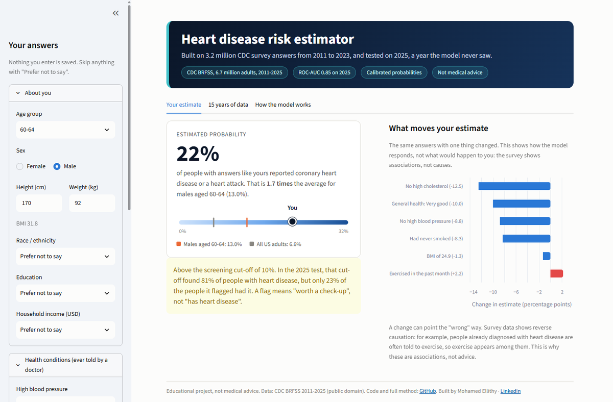
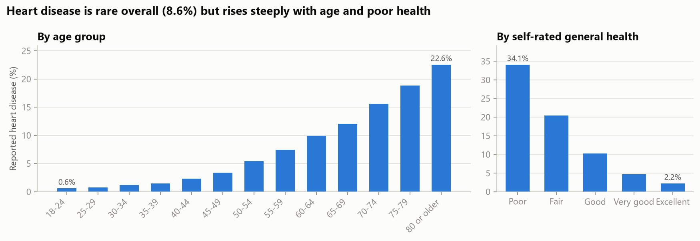
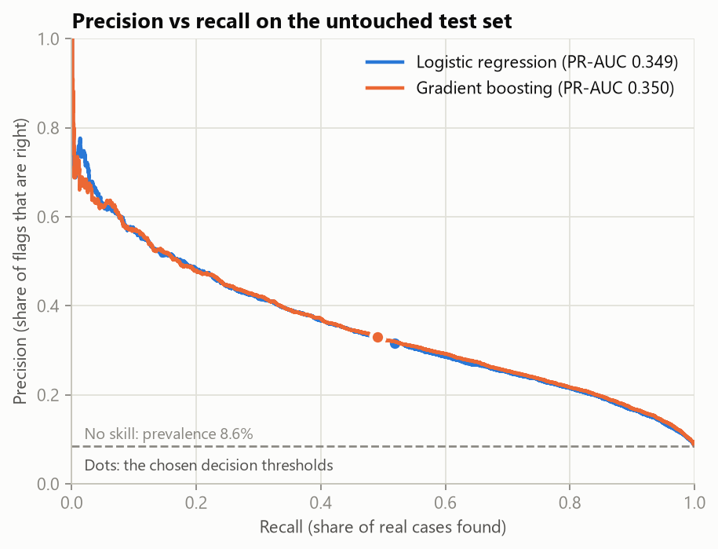
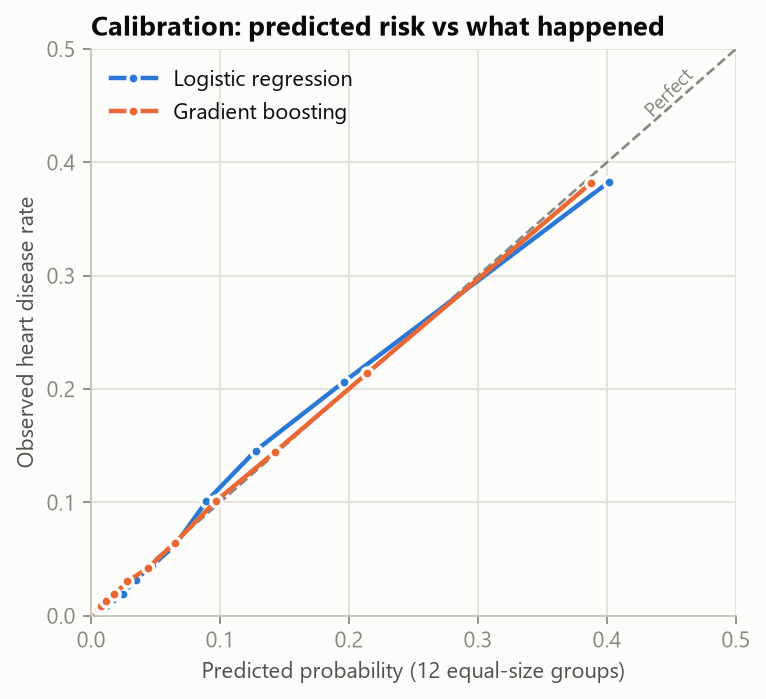
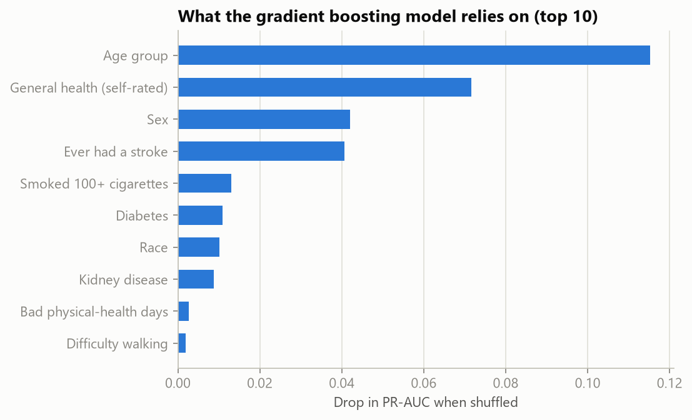

# Heart Disease Risk Model (CDC survey, 320k US adults)

Estimates the probability that an adult has ever been told they have coronary heart disease or had a heart attack, from 17 answers in the CDC's 2020 BRFSS health survey.

This is a 2026 rebuild of my 2022 version. An audit showed that the 2022 results (F1 0.91, accuracy 95%) came from a data leak. The honest F1 of that method is 0.29. This version fixes the evaluation, improves the model and replaces the old Heroku app.

**[Try the app](#the-app)** · [Results](#results) · [The 2022 audit](#what-was-wrong-with-the-2022-version) · [Reproduce](#reproduce)



## Key results

Measured once, at the end, on 63,959 people the model never saw during training or tuning (8.6% of them reported heart disease).

| Model | ROC-AUC | PR-AUC | F1 | Precision | Recall | Accuracy |
|---|---|---|---|---|---|---|
| Always answer "No" (baseline) | 0.500 | 0.086 | 0.000 | n/a | 0.000 | 91.4% |
| Logistic regression | 0.837 | 0.349 | 0.393 | 0.317 | 0.518 | 86.3% |
| **Gradient boosting** (used in the app) | **0.841** | **0.350** | **0.394** | **0.329** | **0.491** | 87.1% |

- **Accuracy is the wrong metric here:** answering "No" for everyone scores 91.4% and finds nobody. The main metric is PR-AUC, where no skill scores 0.086.
- **The probabilities are trustworthy:** among people the model gives about 20%, about 20% reported heart disease ([calibration chart](#results)).
- **Two ways to use it:** at the F1 cut-off (21%), about 1 in 3 flags is right and half the cases are found. At a screening cut-off (9%), 80% of cases are found and about 1 in 5 flags is right.

## What was wrong with the 2022 version

The 2022 pipeline undersampled the **whole dataset** with Edited Nearest Neighbours (ENN) **before** splitting it into training and test sets. ENN deletes the "No" answers that look most like "Yes" answers, which are exactly the hard cases. Because this happened before the split, the test set lost its hard cases too, and the share of heart disease in it rose from 9% to 25%. The 9 features were also chosen on that undersampled data.

[`leakage_audit.py`](src/heart_risk/leakage_audit.py) reruns the 2022 pipeline, then reruns the same method in the correct order (split first, undersample the training rows only):

| | Test set | F1 | Precision | Recall | Accuracy |
|---|---|---|---|---|---|
| A. 2022, as reported (reproduced) | undersampled, 25% positive | 0.905 | 0.935 | 0.877 | 95.4% |
| B. Same 2022 method, fair test | untouched, 9% positive | **0.294** | 0.176 | 0.877 | 61.9% |
| C. This version | untouched, 8.6% positive | **0.394** | 0.329 | 0.491 | 87.1% |

In real use, the 2022 model would have raised 22,318 false alarms to find 4,781 cases: fewer than 1 in 5 of its "positive" results were right.


Other fixes:
- Duplicate rows (18,078) are kept. In a survey with mostly Yes/No answers, different people often give identical answers.
- Diabetes keeps its 4 answers. The 2022 version merged "during pregnancy only" into "Yes", but that group's heart disease rate (4.2%) is lower than the "No" group's (6.5%). "Yes" is 22.0%.
- The app shows a probability with context, instead of "You probably have a heart disease!".

## Data

- **Source:** CDC Behavioral Risk Factor Surveillance System (BRFSS) 2020, a yearly US telephone health survey. Cleaned and reduced to 18 columns by Kamil Pytlak: [Personal Key Indicators of Heart Disease](https://www.kaggle.com/datasets/kamilpytlak/personal-key-indicators-of-heart-disease) (Kaggle, licence CC0: Public Domain). Stored here as [`data/heart_2020_cleaned.csv.gz`](data/).
- **Size:** 319,795 adults, no missing values. 27,373 (8.6%) answered yes to `HeartDisease`: they had ever reported coronary heart disease or a myocardial infarction.
- **17 inputs:** age group, sex, race, BMI, smoking, heavy drinking, physical activity, sleep hours, self-rated general health, poor physical and mental health days, stroke, difficulty walking, diabetes, asthma, kidney disease, skin cancer.

## What the data shows



| Answer | Heart disease rate if Yes | if No |
|---|---|---|
| Ever had a stroke | 36.4% | 7.5% |
| Kidney disease | 29.3% | 7.8% |
| Difficulty walking | 22.6% | 6.3% |
| Smoked 100+ cigarettes | 12.2% | 6.0% |
| Physically active | 7.1% | 13.8% |
| Heavy drinking | 5.2% | 8.8% |

Heavy drinkers have a *lower* rate, which is a warning about reading these as causes: people who become ill often stop drinking, so the survey sees fewer ill people among current drinkers.

## Method

1. **Split first.** One stratified 80/20 split before anything else. The test set keeps the real 8.6% rate and is used once, at the end.
2. **One pipeline from raw answers to probability.** Yes/No and ordered answers (age, general health) are encoded in order, race and diabetes are one-hot encoded, numbers are standardised. All inside a scikit-learn `Pipeline`, so the saved model takes the survey answers as they are.
3. **Two models, no resampling.** Logistic regression (explainable: every coefficient is an odds ratio) and histogram gradient boosting (captures interactions such as age by general health). Undersampling or class weights would distort the probabilities, so the imbalance is handled when choosing the decision threshold.
4. **Choices made on the training data only.** 5-fold cross-validation on the training set gave out-of-fold probabilities. The model was chosen on PR-AUC (gradient boosting 0.349, logistic regression 0.346), and the two cut-offs were chosen from those out-of-fold results.
5. **Final test once**, on the untouched 20%.

## Results

| Precision vs recall | Calibration |
|---|---|
|  |  |

The two models are almost identical: gradient boosting is ahead by 0.001 to 0.004 on every ranking metric. The survey answers, not the algorithm, set the ceiling.

**What drives the predictions.** Permutation importance (how much PR-AUC drops when one answer is shuffled) and the logistic regression odds ratios agree on the main factors:



| Factor (logistic regression) | Odds ratio |
|---|---|
| Ever had a stroke | 2.8 |
| Male | 2.1 |
| Kidney disease | 1.8 |
| Diabetes (Yes vs No) | 1.6 |
| Smoked 100+ cigarettes | 1.4 |
| Each older age group (5 years) | 1.3 |
| Each step better in general health | 0.6 |

**Performance by group** (gradient boosting, F1 cut-off):

| Group | People | Heart disease rate | ROC-AUC | Recall | Precision |
|---|---|---|---|---|---|
| Men | 30,446 | 10.5% | 0.839 | 0.57 | 0.34 |
| Women | 33,513 | 6.8% | 0.835 | 0.38 | 0.31 |
| Age 18-44 | 19,584 | 1.3% | 0.790 | 0.08 | 0.31 |
| Age 45-64 | 22,159 | 7.0% | 0.799 | 0.34 | 0.31 |
| Age 65+ | 22,216 | 16.5% | 0.756 | 0.58 | 0.33 |

Ranking quality is similar for men and women, but one shared cut-off finds far fewer cases among women and younger adults, whose base rates are lower. A real screening tool would need cut-offs chosen per group, or a decision made together with a clinician.

## Limitations

- **Self-reported and cross-sectional.** The survey asks whether a doctor *ever* told the person they had heart disease. Some inputs (stroke, difficulty walking, poor health days) may be consequences of heart disease rather than causes.
- **Associations, not causes.** The app's what-if table shows how the model responds to a changed answer, not what would happen to a person.
- **Population.** US adults in 2020. Rates and risk factors differ elsewhere.
- **Not a diagnostic tool.** It is a portfolio project about honest evaluation.
- **Next step:** the 2022 update of this dataset (about 40 variables, 400k+ adults) is a natural extension.

## The app

A [Streamlit](https://streamlit.io) app ([`app/streamlit_app.py`](app/streamlit_app.py)) with 17 inputs. It shows:
- the estimated probability,
- the average for people of the same age group and sex,
- a note when the estimate is above the screening cut-off,
- how the estimate changes if one changeable answer is different (smoking, activity, general health, BMI).

## Reproduce

```bash
python -m venv .venv
# Windows: .venv\Scripts\activate    macOS/Linux: source .venv/bin/activate
pip install -r requirements-dev.txt

cd src
python -m heart_risk.train          # cross-validation, thresholds, saves models/ (about 1 minute)
python -m heart_risk.evaluate       # test-set results and charts in reports/
python -m heart_risk.leakage_audit  # the 2022 audit (about 3 minutes)
cd ..

pytest                              # data, split and model checks
streamlit run app/streamlit_app.py
```

The versions are pinned because the saved model must be loaded with the same scikit-learn version it was trained with (1.9.0). The tests also run on GitHub Actions on every push.

## Project structure

```
data/heart_2020_cleaned.csv.gz   the survey data (2.6 MB)
src/heart_risk/
    data.py             loading and the single train/test split
    features.py         column groups and the preprocessing step
    models.py           the two candidate pipelines
    metrics.py          metrics and threshold selection
    train.py            cross-validation, model choice, saving
    evaluate.py         final test, subgroups, charts
    leakage_audit.py    reproduction of the 2022 evaluation
    charts.py           chart style
models/                 saved pipelines + metadata.json (thresholds, versions)
reports/                metrics.json, leakage_audit.json, figures/
app/streamlit_app.py    the app
tests/                  pytest checks
```

## History

The original 2022 version was my capstone project for the Epsilon AI data science programme. Its notebooks, Flask app and recorded presentation are kept under the tag [`v2022-original`](https://github.com/mellithyy/heart-disease-diagnosis/tree/v2022-original).

## Author

Mohamed Ellithy · [LinkedIn](https://www.linkedin.com/in/mohamed-el-lithy/) · [GitHub](https://github.com/mellithyy)
